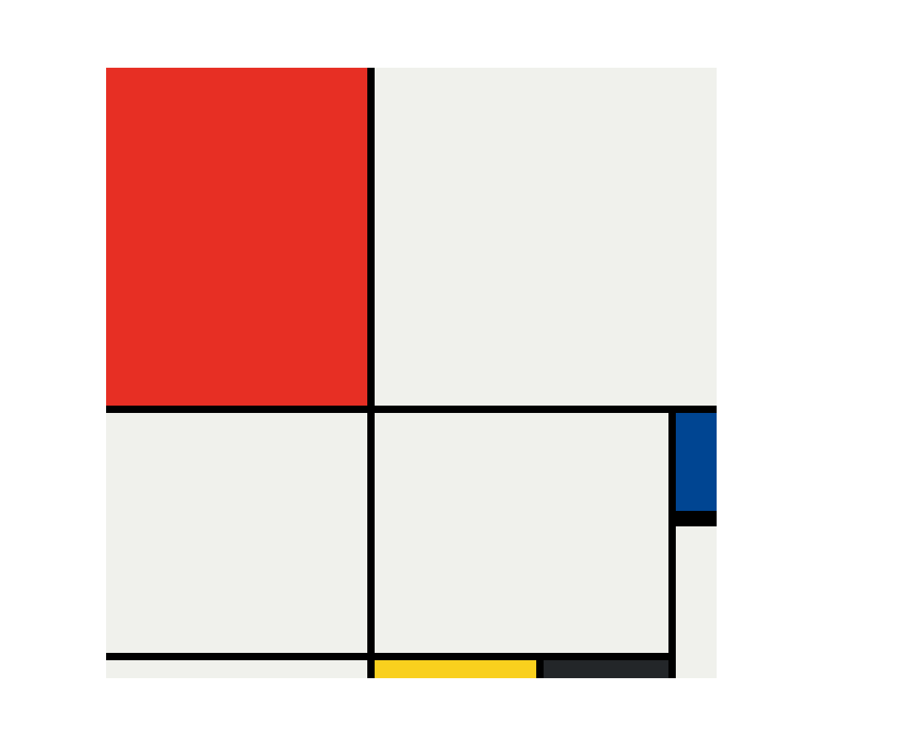

# 🎨 Mondrian Painting using CSS Grid & Flexbox  

This project recreates a **Piet Mondrian style abstract painting** using **pure HTML & CSS**.  
It demonstrates the use of **CSS Grid** and **Flexbox** for modern layout design.  

---

## 🛠️ Tech Stack  

<p align="left">
  
  
  
  
</p>

---

## ✨ Features  

- ✅ Mondrian-inspired abstract design  
- ✅ Built with **pure CSS (Grid + Flexbox)**  
- ✅ No external libraries used  
- ✅ Fully responsive  

---

## 🚀 Getting Started (Run Locally)  

1. Clone the repository  
```bash
   git clone https://github.com/Mayuresh3843/Mondrian-painting-using-css-grid.git
```

2. Navigate to project folder
```bash
cd Mondrian-painting-using-css-grid
```
3. Open index.html in your browser 🎨

## 📸 Screenshots  

### 

